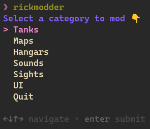
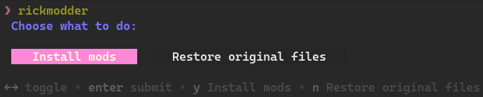
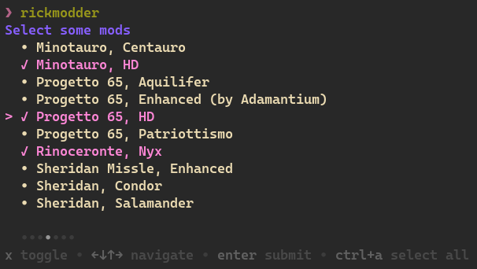
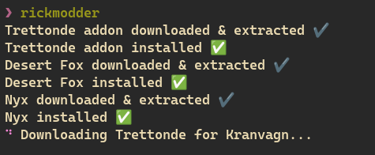
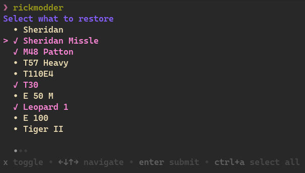
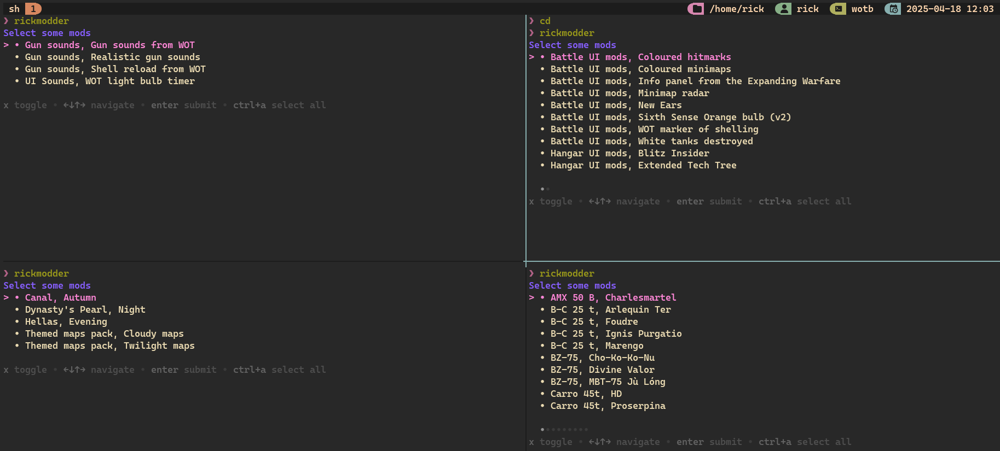

# Welcome to my Wotb mod loader

- A "simple" TUI script written in bash for installing and backing-up tons of mods quickly and with 0 effort.

> **Notes:**
>
> - I'm not the developer of any mods (I will add the sources for each mod).
> - All mods will be downloaded from:
>   1. [BlitzMods](https://blitz-mods.com)
>   2. [ForBlitz](https://forblitz.ru)
>   3. My Google Drive (for now) for old or Discord servers mods (always with a link).

# Compatibility (Steam only)

- Linux (installed in `.local/share/Steam/...`) ✅
- Android 🔜
- Macs 🔜
- Windows ❌ (never)

# Dependencies

## Must have

- [Gum Charm](https://github.com/charmbracelet/gum)
- [rsync](https://github.com/RsyncProject/rsync)
- [7z](https://www.7-zip.org/download.html)
- [jq](https://jqlang.org/)

## Optional

- [Tmux](https://github.com/tmux/tmux)

# Installation

1. Clone the repository: `git clone https://github.com/RickOnGit/RickWotbMods ~`
2. From the terminal run: `cd RickWotbMods/bin; ./setup.sh`
   - setup.sh will create the backup folder (same location as Data, for more read this 👉 [BlitzMods Forum](https://discord.com/channels/1145391956114022450/1325784848811561010)), and add the main script (_rickmooder_) to `/usr/local/bin`
3. Just run `rickmodder` anywhere in the shell and start downloading mods !!.

# Usage

#### Main menu

#### Install and restore option

#### Download menu

#### Downloading information

#### Restore menu

- Working for everything except for UI elements (kinda a mess)
  

#### _Wanna do things faster? Use tmux!!_

# P.S.

- You may notice that some mods and features aren't implemented yet but there is time for that... just show support for the project and I will do my best to implement those 👍
